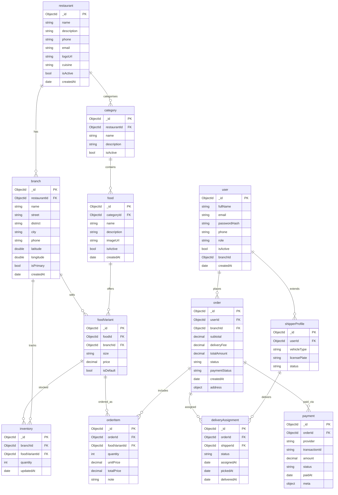

# TOMATO - Food Ordering Website

This repository hosts the source code for TOMATO, a dynamic food ordering website built with the MERN stack. It offers a user-friendly platform for seamless online food ordering.

## Demo

- User Panel: [https://food-delivery-frontend-s2l9.onrender.com/](https://food-delivery-frontend-s2l9.onrender.com/)
- Admin Panel: [https://food-delivery-admin-wrme.onrender.com/](https://food-delivery-admin-wrme.onrender.com/)

## Features

- User Panel
- Admin Panel
- JWT Authentication
- Password Hashing with Bcrypt
- Stripe Payment Integration
- Login/Signup
- Logout
- Add to Cart
- Place Order
- Order Management
- Products Management
- Filter Food Products
- Authenticated APIs
- REST APIs
- Role-Based Identification
- Toast notifications

## Screenshots


- Hero Section


- Products Section


- Cart Page


- Login Popup

## Docker Compose Setup

You can spin up the complete stack with Docker:

1. Build and start the services:
   ```bash
   docker compose up --build
   ```
   The stack exposes the frontend at `http://localhost:5173`, the admin panel at `http://localhost:5174`, and the API at `http://localhost:4000`.
2. Connect MongoDB clients (Compass, mongosh, etc.) via `mongodb://localhost:27017/fooddeliverydb`. Port 27017 is published so you can browse data directly from Windows.
3. Seed demo menu/branch data (restaurants, branches, foods, variants, drones):
   ```bash
   npm run seed:v2
   ```
> After seeding you can browse collections such as `restaurant`, `branch`, `category`, `food`, `foodVariant`, `order`, and `payment`.

To rebuild after code changes you can run `docker compose up --build` again, or `docker compose up` if the images are already built.

## MongoDB ERD (Expanded)



## Menu & Order v2 Highlights

- Backend v2 introduces restaurants, branches, categories, foods and variants so pricing can vary by size/branch.
- New `/api/v2/menu` endpoints serve the dynamic menu and expose admin endpoints to create categories/foods.
- `/api/v2/orders/confirm-payment` confirms payment and instantly assigns the order to an available drone shipper (vehicle type `drone`).
- Dashboard roles: admin (manage menu, inventory, shippers, orders) and branch managers (view branch menu, adjust inventory, monitor orders).
- Checkout flow now supports Cash on Delivery and a simulated Visa payment step.
- Admins manage live orders with `/api/v2/orders` and patch statuses via `/api/v2/orders/:id/status`.

## Run Locally

Clone the project

```bash
    git clone https://github.com/Mshandev/Food-Delivery
```
Go to the project directory

```bash
    cd Food-Delivery
```
Install dependencies (all apps)

```bash
    npm install
```
> The root `postinstall` script installs backend, frontend, and admin dependencies automatically, so you only run the command once.

Start all apps locally in one terminal

```bash
    npm run dev
```
> This uses `concurrently` to run the backend, frontend, and admin dev servers together.

### Seed demo menu data

```bash
npm run seed:v2
```

Default accounts after running `npm run seed:v2`:
- Admin dashboard: `admin@example.com` / `admin1234`
- Branch manager dashboard: `branch.manager@example.com` / `branch1234`
- Sample customer: `user@example.com` / `user1234`

### Environment Variables

Create `.env` inside `backend/` and set your configuration:

```
JWT_SECRET=YOUR_SECRET_TEXT
SALT=YOUR_SALT_VALUE
MONGO_URL=YOUR_DATABASE_URL
STRIPE_SECRET_KEY=YOUR_KEY
```

Update frontend/admin URLs if you deploy to another host (see `frontend/src/context/StoreContext.jsx` and `admin/src/App.jsx`).

## Tech Stack
* [React](https://reactjs.org/)
* [Node.js](https://nodejs.org/en)
* [Express.js](https://expressjs.com/)
* [MongoDB](https://www.mongodb.com/)
* [Stripe](https://stripe.com/)
* [JWT](https://jwt.io/introduction)
* [Multer](https://www.npmjs.com/package/multer)

## Deployment

The application is deployed on Render.

## Contributing

Contributions are always welcome! Just raise an issue and we can discuss it.

## Feedback

If you have any feedback, please reach out to me [here](https://www.linkedin.com/in/muhammad-shan-full-stack-developer/)
