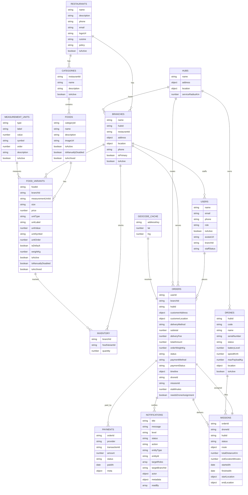

# ERD (post-legacy-cleanup, from code)

Source: backend models v2 + controllers/services actually used by UI (not from .md/.puml). Legacy fields are kept in schema for compatibility but no longer used by UI; marked `[legacy/unused]`.

## Core relationships
- restaurants 1--* branches (`branches.restaurantId`).
- hubs 1--* branches (`branches.hubId`), 1--* drones, 1--* missions, 1--* orders (`orders.hubId`).
- categories 1--* foods (`foods.categoryId`) 1--* foodVariants (`foodVariants.foodId`).
- foodVariants belong to branches (`branchId`) and optionally measurementUnits (`measurementUnitId`); inventory ties `branchId` + `foodVariantId`; `orders.items.foodVariantId` references variants.
- users place orders (`orders.userId`) and can belong to a branch (`users.branchId` for staff).
- payments belong to orders (unique per {orderId, provider}).
- missions are canonical delivery link: 1:1 to orders, pointing to drones/hubs; droneAssignments retained but legacy for UI.
- notifications target roles/branch; actor/readBy reference users/branches.
- geocodeCache caches address → lat/lng.

## Entities and fields
### restaurants
| Field | Type | Notes |
| --- | --- | --- |
| _id | ObjectId | PK |
| name | String | required, unique index |
| description | String |  |
| phone | String |  |
| email | String |  |
| logoUrl | String |  |
| cuisine | String |  |
| policy | String |  |
| isActive | Boolean | default true |
| createdAt/updatedAt | Date | auto |

### branches
| Field | Type | Notes |
| --- | --- | --- |
| _id | ObjectId | PK |
| restaurantId | ObjectId -> restaurants | required |
| hubId | ObjectId -> hubs | optional |
| name | String | required, unique per restaurant when active |
| address | Subdoc | street, ward, district, city, country, fullText |
| street/district/city/country | String | [legacy/unused by UI] mirrored for compatibility |
| location | GeoJSON Point | 2dsphere index |
| latitude/longitude | Number | [legacy/unused by UI] |
| phone | String |  |
| isPrimary | Boolean | marks main branch |
| isActive | Boolean | default true |
| createdAt/updatedAt | Date | auto |

### hubs
| Field | Type | Notes |
| --- | --- | --- |
| _id | ObjectId | PK |
| name | String | required, unique |
| address | Subdoc | street, ward, district, city, country, fullText |
| location | GeoJSON Point | required, 2dsphere |
| serviceRadiusKm | Number | service radius |
| createdAt/updatedAt | Date | auto |

### categories
| Field | Type | Notes |
| --- | --- | --- |
| _id | ObjectId | PK |
| restaurantId | ObjectId -> restaurants | required |
| name | String | required, unique per restaurant |
| description | String |  |
| isActive | Boolean | default true |
| createdAt/updatedAt | Date | auto |

### foods
| Field | Type | Notes |
| --- | --- | --- |
| _id | ObjectId | PK |
| categoryId | ObjectId -> categories | required |
| name | String | required, unique per category |
| description | String |  |
| imageUrl | String |  |
| isActive | Boolean | default true |
| isManuallyDisabled | Boolean | default false |
| isArchived | Boolean | default false |
| createdAt/updatedAt | Date | auto |

### foodVariants
| Field | Type | Notes |
| --- | --- | --- |
| _id | ObjectId | PK |
| foodId | ObjectId -> foods | required |
| branchId | ObjectId -> branches | required |
| size | String | required |
| price | Number | required |
| measurementUnitId | ObjectId -> measurementUnits | optional |
| unitType/unitLabel/unitValue/unitSymbol/unitOrder | Mixed | unit metadata |
| isDefault | Boolean | default false |
| weightKg | Number | used for payload calc |
| isActive/isManuallyDisabled/isArchived | Boolean | status flags |
| createdAt/updatedAt | Date | auto |

### measurementUnits
| Field | Type | Notes |
| --- | --- | --- |
| _id | ObjectId | PK |
| type | String | required, lowercase |
| label | String | required, unique by type (case-insensitive) |
| value | Number | numeric value |
| symbol | String |  |
| order | Number | sort order |
| description | String | display text |
| isActive | Boolean | default true |
| createdAt/updatedAt | Date | auto |

### inventory
| Field | Type | Notes |
| --- | --- | --- |
| _id | ObjectId | PK |
| branchId | ObjectId -> branches | required |
| foodVariantId | ObjectId -> foodVariants | required, unique per branch |
| quantity | Number | default 0 |
| updatedAt | Date | manually set on updates |
| createdAt | Date | auto |

### users
| Field | Type | Notes |
| --- | --- | --- |
| _id | ObjectId | PK |
| name | String | required |
| email | String | required, unique |
| password | String | required |
| phone | String |  |
| role | String | default user (admin/super_admin/staff supported) |
| isActive | Boolean | default true |
| avatarUrl | String |  |
| branchId | ObjectId -> branches | optional (staff) |
| cartData | Mixed | cart snapshot |
| staffStatus | String | enum active/inactive/on_leave |
| createdAt/updatedAt | Date | mongoose defaults |

### orders
| Field | Type | Notes |
| --- | --- | --- |
| _id | ObjectId | PK |
| userId | ObjectId -> users | required |
| branchId | ObjectId -> branches | required |
| hubId | ObjectId -> hubs | optional |
| items | [Subdoc] | see order.items |
| customerAddress | address schema | canonical customer address |
| customerLocation | GeoJSON Point | canonical drop-off |
| address | Mixed | [legacy/unused by UI] |
| dropoffAddress/dropoffLat/dropoffLng | Mixed/Number | [legacy/unused by UI] |
| pickupBranchId | ObjectId -> branches | optional |
| pickupLat/pickupLng | Number | [legacy/unused by UI] |
| subtotal/deliveryFee/totalAmount | Number | required |
| orderWeightKg | Number | used for payload |
| payloadWeightKg | Number | [legacy/unused] |
| deliveryMethod | String | enum; default drone |
| status | String | unified enum (CREATED/WAITING_FOR_DRONE/ASSIGNED/PREPARING/DELIVERING/ARRIVED/COMPLETED/CANCELED plus legacy) |
| cancellationReason/cancelledAt/cancelledBy | String/Date/ObjectId | cancel info |
| paymentMethod | String | enum COD/ONLINE/MOMO/STRIPE/VNPAY/OTHER |
| paymentStatus | String | enum unpaid/paid/refunded + PENDING/PAID/FAILED/REFUNDED |
| timeline | [Subdoc] | see order.timeline |
| droneId | ObjectId -> drones | optional |
| missionId | ObjectId -> missions | optional |
| etaMinutes | Number | ETA display |
| needsDroneAssignment/lastDroneAssignAttemptAt/droneAssignRetries | flags for auto-assign |
| createdAt/updatedAt | Date | auto |

#### order.items
| Field | Type | Notes |
| --- | --- | --- |
| foodVariantId | ObjectId -> foodVariants | required |
| title | String | item name snapshot |
| size | String |  |
| quantity | Number | min 1 |
| unitPrice/totalPrice | Number | required |
| notes | String | [legacy/unused in UI] |

#### order.timeline
| Field | Type | Notes |
| --- | --- | --- |
| status | String | required |
| actorType | String | enum user/admin/staff/system/drone |
| at | Date | timestamp |
| actor | ObjectId | reference id |

### payments
| Field | Type | Notes |
| --- | --- | --- |
| _id | ObjectId | PK |
| orderId | ObjectId -> orders | required |
| provider | String | enum vnpay/stripe/momo/zalopay/cash/card |
| transactionId | String | optional |
| amount | Number | required |
| status | String | enum pending/success/failed/refunded |
| paidAt | Date |  |
| meta | Object | gateway payload |
| createdAt/updatedAt | Date | auto |

### drones
| Field | Type | Notes |
| --- | --- | --- |
| _id | ObjectId | PK |
| code | String | required, unique |
| name | String |  |
| serialNumber | String | unique sparse |
| hubId | ObjectId -> hubs | primary link |
| branchId | ObjectId -> branches | [legacy/unused by UI] |
| status | String | enum AVAILABLE/ASSIGNED/... + legacy |
| batteryLevel | Number | 0-100 |
| speedKmh | Number | ETA calc |
| maxPayloadKg | Number | default 2 |
| location | GeoJSON Point | 2dsphere |
| lastKnownLat/lastKnownLng | Number | [legacy/unused] |
| isActive | Boolean | default true |
| createdAt/updatedAt | Date | auto |

### droneAssignments (legacy for UI; missions are canonical)
| Field | Type | Notes |
| --- | --- | --- |
| _id | ObjectId | PK |
| orderId | ObjectId -> orders | required, unique |
| droneId | ObjectId -> drones | required |
| status | String | enum assigned/en_route_pickup/... |
| assignedAt/enRoutePickupAt/pickedAt/enRouteDropoffAt/deliveredAt/cancelledAt/failedAt | Date | [legacy/unused in UI] |
| meta | Object | [legacy/unused in UI] |
| createdAt/updatedAt | Date | auto |

### missions (canonical for delivery routing)
| Field | Type | Notes |
| --- | --- | --- |
| _id | ObjectId | PK |
| orderId | ObjectId -> orders | required, unique |
| droneId | ObjectId -> drones | required |
| hubId | ObjectId -> hubs | optional |
| status | String | enum PLANNED/EN_ROUTE_PICKUP/AT_PICKUP/EN_ROUTE_DELIVERY/ARRIVED/DELIVERED/RETURNING/COMPLETED/CANCELED |
| route | GeoJSON LineString | stored; UI can consume |
| waypoints | [String] | optional |
| totalDistanceKm/estDurationMinutes | Number | stored |
| startedAt/finishedAt | Date |  |
| startLocation/endLocation | GeoJSON Point | optional |
| createdAt/updatedAt | Date | auto |

### notifications
| Field | Type | Notes |
| --- | --- | --- |
| _id | ObjectId | PK |
| title | String | required |
| message | String |  |
| level | String | enum info/success/warning/error |
| status | String | enum success/failed/pending |
| action | String | enum create/update/delete/status/other |
| entityType/entityId | String/ObjectId | optional |
| targetRoles | [String] | default ["admin"] if missing |
| targetBranchId | ObjectId -> branches | optional |
| actor | Subdoc | userId/name/role/branchId snapshot |
| metadata | Mixed |  |
| readBy | [ObjectId -> users] | read tracking |
| createdAt/updatedAt | Date | auto |

### geocodeCache
| Field | Type | Notes |
| --- | --- | --- |
| _id | ObjectId | PK |
| addressKey | String | required, unique |
| lat/lng | Number | cached coordinates |
| provider | String | [legacy/unused by UI] |
| createdAt/updatedAt | Date | auto |

