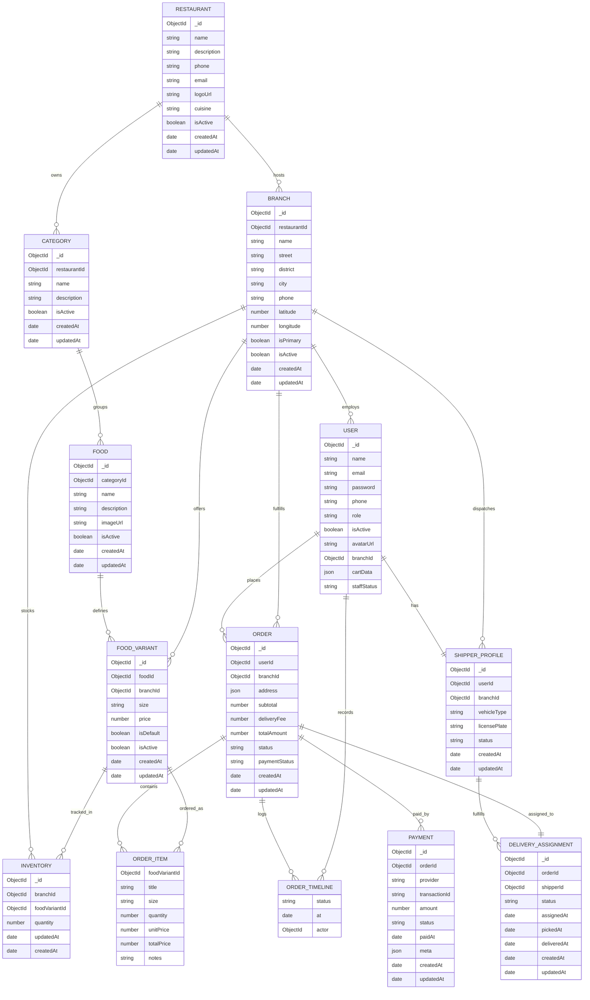

# So do he thong (Mermaid)

## Kien truc trien khai
```mermaid
flowchart LR
  subgraph Client
    F[Frontend (Vite 5173)]
    A[Admin (Vite 5174)]
  end
  B[Backend API (Express 4000)]
  M[(MongoDB 27017)]

  F -->|REST| B
  A -->|REST| B
  B -->|Mongoose| M
```

## Mo hinh du lieu (chi tiet)

