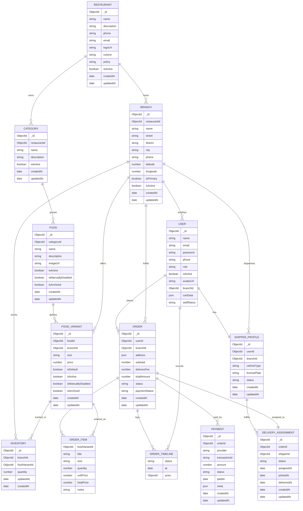

# So do he thong (Mermaid)

## Kien truc trien khai
```mermaid
flowchart LR
  subgraph Client
    F[Frontend (Vite 5173)]
    A[Admin (Vite 5174)]
  end
  B[Backend API (Express 4000)]
  M[(MongoDB 27017)]

  F -->|REST| B
  A -->|REST| B
  B -->|Mongoose| M
```

## Mo hinh du lieu (chi tiet)


## Giai thich ERD: Thuc the va Moi quan he

- RESTAURANT → BRANCH (1–n)
  - 1 nhà hàng có nhiều chi nhánh. `branch.restaurantId -> restaurant._id`.
  - Dùng khi liệt kê chi nhánh theo thương hiệu.

- RESTAURANT → CATEGORY (1–n)
  - Danh mục món thuộc phạm vi 1 nhà hàng. `category.restaurantId -> restaurant._id`.

- CATEGORY → FOOD (1–n)
  - 1 danh mục có nhiều món. `food.categoryId -> category._id`.

- FOOD → FOOD_VARIANT (1–n)
  - 1 món có nhiều biến thể (size/giá). `foodVariant.foodId -> food._id`.

- BRANCH → FOOD_VARIANT (1–n)
  - Biến thể áp dụng theo chi nhánh (giá/size có thể khác nhau). `foodVariant.branchId -> branch._id`.

- BRANCH → INVENTORY ↔ FOOD_VARIANT (n–1 & 1–n)
  - Tồn kho theo cặp (branch, foodVariant). `inventory.branchId`, `inventory.foodVariantId`.
  - Gợi ý unique: `(branchId, foodVariantId)`.

- USER → ORDER (1–n) và BRANCH → ORDER (1–n)
  - Mỗi đơn gắn 1 user đặt và 1 chi nhánh xử lý. `order.userId`, `order.branchId`.

- ORDER → ORDER_ITEM (1–n) ↔ FOOD_VARIANT
  - Mỗi dòng hàng tham chiếu biến thể tại thời điểm đặt. `orderItem.foodVariantId`.

- ORDER → ORDER_TIMELINE (1–n) với USER (actor)
  - Nhật ký diễn biến đơn. `timeline.actor -> user._id` (user/staff/shipper/hệ thống).

- ORDER → PAYMENT (1–n)
  - Lưu giao dịch thanh toán (Stripe...). `payment.orderId -> order._id`.

- USER → SHIPPER_PROFILE (1–1) và BRANCH → SHIPPER_PROFILE (1–n)
  - Hồ sơ shipper của 1 user và chi nhánh làm việc. `shipperProfile.userId`, `shipperProfile.branchId`.

- SHIPPER_PROFILE → DELIVERY_ASSIGNMENT (1–n) và ORDER → DELIVERY_ASSIGNMENT (1–1 tại thời điểm hoạt động)
  - Bản ghi phân công giao cho 1 đơn. `deliveryAssignment.shipperId`, `deliveryAssignment.orderId`.

Ghi ch├║ `USER.branchId`:
- Dùng cho nhân sự (staff/shipper) để biết thuộc chi nhánh nào.
- Với khách hàng (role = customer), không bắt buộc → để null. Chi nhánh phục vụ đơn nằm ở `ORDER.branchId`.

## Luong du lieu chinh

1) Duyet menu (khach hàng)
- Client → GET `/api/v2/menu/default?branchId=...`
- Backend tổng hợp Category → Food → FoodVariant theo chi nhánh.

2) Tao don hang
- Client gửi `{ branchId, items:[{foodVariantId, quantity, notes?}], address }` → POST `/api/v2/orders`.
- Backend kiểm tra tồn kho cơ bản (tùy chính sách), tính tổng tiền, tạo ORDER + ORDER_ITEM, thêm timeline `pending`.

3) Thanh toan (Stripe)
- Tạo intent: POST `/api/v2/orders/pay/stripe` → trả về client secret.
- Xác nhận: POST `/api/v2/orders/confirm-payment` → lưu PAYMENT, cập nhật `order.paymentStatus` + timeline `payment_confirmed` (hoặc `payment_failed`).

4) Xu ly don (Admin/Staff)
- Cập nhật `status`: PATCH `/api/v2/orders/:id/status` (pending→confirmed→preparing→delivered/cancelled...).
- Mỗi lần đổi trạng thái, append timeline tương ứng.

5) Cap nhat ton kho
- Khi order vào giai đoạn chuẩn bị, giảm `INVENTORY.quantity` theo từng `foodVariantId` tại `branchId`.
- API: GET/POST `/api/v2/inventory` để xem/cập nhật tồn.

6) Phan cong shipper
- Tạo/ cập nhật `DELIVERY_ASSIGNMENT` cho `ORDER` khi `status = assigned`.
- `SHIPPER_PROFILE.status` chuyển `available↔busy` theo tiến trình; timeline thêm `assigned`, `delivering`, `delivered`.

7) Huy/Hoan tien (tuy chon)
- Nếu hủy sau thanh toán, tạo PAYMENT mới (refund/void) và timeline `cancelled`.

## Rangan buoc & Index de xuat

- INVENTORY: unique `(branchId, foodVariantId)`; index `{ branchId, updatedAt }`.
- FOOD_VARIANT: index `{ foodId, branchId, isDefault }`.
- ORDER: index `{ userId, createdAt }`, `{ branchId, status, createdAt }`.
- PAYMENT: index `{ orderId, createdAt }`, `{ provider, transactionId }` (unique nếu cần).
- SHIPPER_PROFILE: index `{ branchId, status }`, unique `{ userId }`.
- USER: index `{ email }` (unique), `{ role, branchId }`.

## Quy tac chuyen trang thai (goi y)

`pending → confirmed → preparing → assigned → delivering → delivered`

- Cho phép `cancelled` từ `pending/confirmed` (tùy chính sách).
- Mỗi chuyển trạng thái phải ghi timeline với `actor` và thời điểm `at`.


